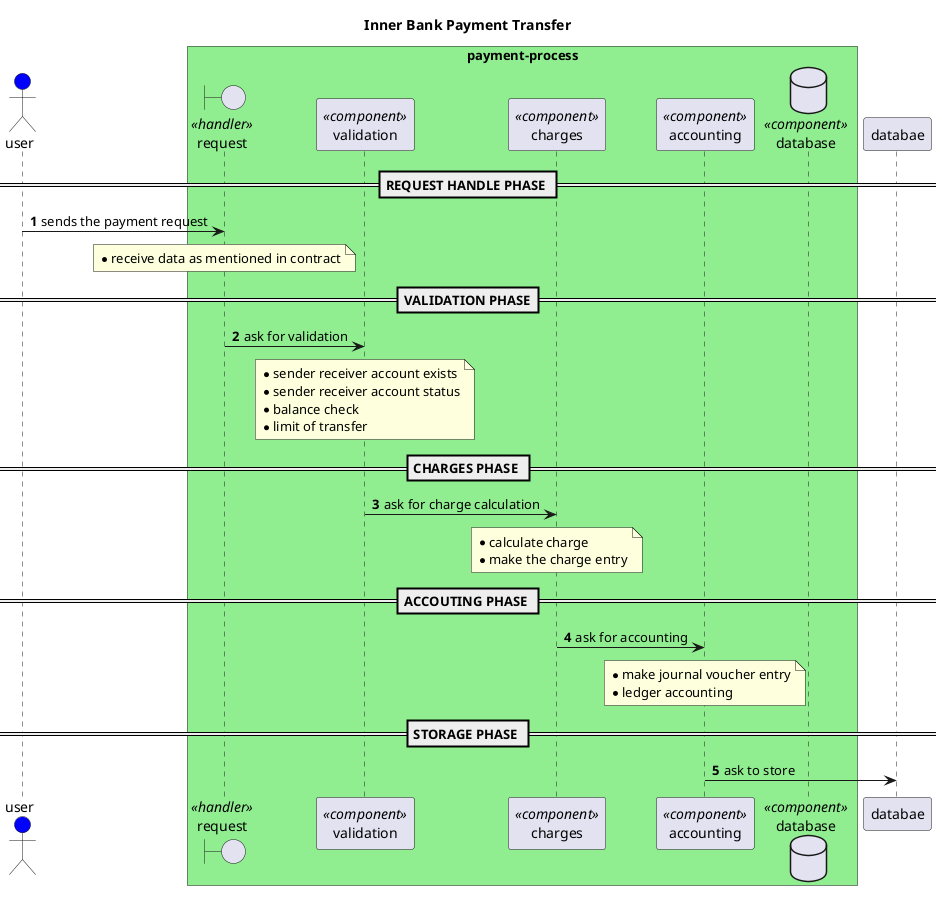

**Payment Process**

```plantuml
@startuml

autonumber
title Inner Bank Payment Transfer

actor "user" as user #blue
box "payment-process" #LightGreen
    boundary "request" as request <<handler>>
    participant "validation" as validation <<component>>
    participant "charges" as charges <<component>>
    participant "accounting" as accounting <<component>>
    database "database" as database <<component>>
 endbox
 
 == REQUEST HANDLE PHASE ==
 user -> request : sends the payment request
 note over request
 * receive data as mentioned in contract
 end note


== VALIDATION PHASE==
 request -> validation: ask for validation
 note over validation
 * sender receiver account exists
 * sender receiver account status 
 * balance check
 * limit of transfer
 end note
 
 == CHARGES PHASE ==
 validation -> charges: ask for charge calculation
 note over charges
 * calculate charge
 * make the charge entry
 end note 
 
 == ACCOUTING PHASE ==
 charges -> accounting : ask for accounting
 note over accounting
 * make journal voucher entry
 * ledger accounting
 end note
 
 == STORAGE PHASE ==
 accounting -> databae : ask to store
 @enduml
```